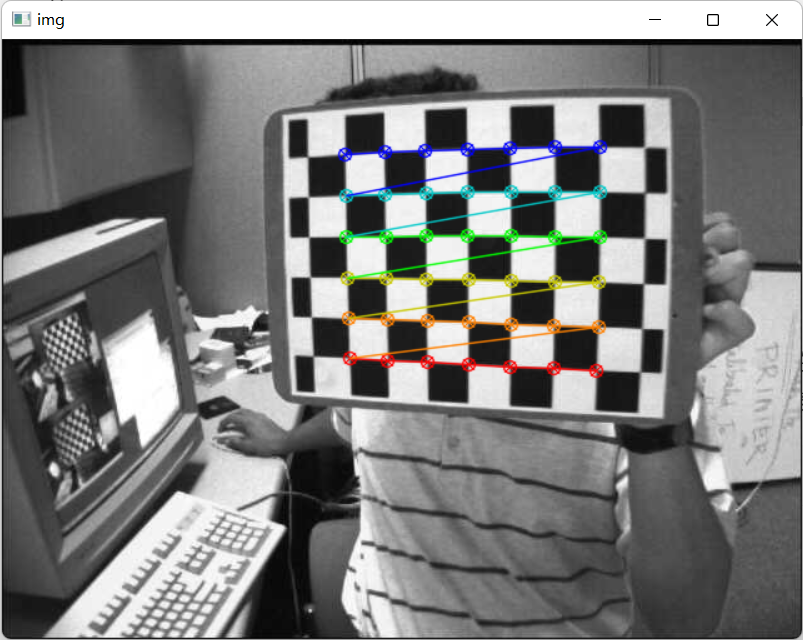
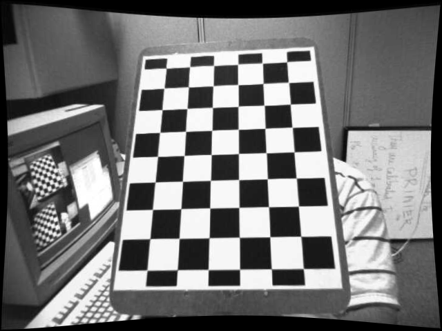
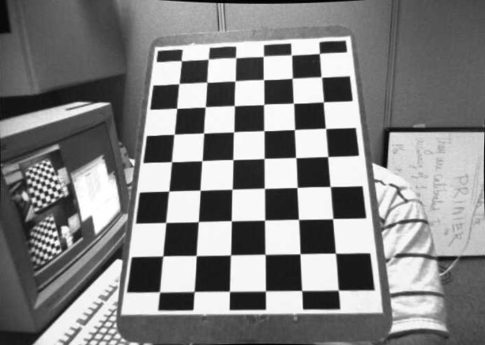

# 2. 使用 OpenCV 进行相机标定

## 引言

随着 20 世纪末廉价针孔相机的引入，相机在我们的日常生活中变得司空见惯。不幸的是，这种廉价是有代价的：严重的失真；幸运的是，这些是常数，通过校准和一些重映射就可以纠正。此外，通过校准，你还可以确定相机的自然单位（像素）和真实世界单位（毫米）之间的关系。

## 原理

对于畸变，OpenCV 考虑了径向畸变和切向畸变。对于径向畸变系数，使用如下公式：

$$
x_{distorted}=x(1+k_{1}r^{2}+k_{2}r^{4}+k_{3}r^{6})
$$

$$
y_{distorted}=y(1+k_{1}r^{2}+k_{2}r^{4}+k_{3}r^{6})
$$

因此，对于在 (x, y) 坐标处未畸变的像素点，其在畸变图像上的位置将是 $(x_{distorted}, y_{distorted})$。径向畸变的存在表现为桶或鱼眼效应。

发生切向畸变是因为图像拍摄镜头和成像平面不完全平行。它可以通过如下公式表示：

$$
x_{distorted}=x+[2p_{1}xy+p_{2}(r^{2}+2x^{2})]
$$

$$
y_{distorted}=y+[p_{1}(r^{2}+2y^{2})+2p_{2}xy]
$$

所以我们共有 5 个畸变参数，它们在 OpenCV 中表示为一个 5 列的行矩阵：

$$
distortion\_coefficients=(k_{1}\quad k_{2}\quad p_{1}\quad p_{2}\quad k_{3})
$$

现在对于单位转换，我们使用如下公式：

$$
\begin{bmatrix} x \\ y \\ w\end{bmatrix} = \begin{bmatrix}
    f_{x}&0&c_{x} \\
    0&f_{y}&c_{y} \\
    0&0&1
\end{bmatrix}\begin{bmatrix}
    X \\
    Y \\
    Z
\end{bmatrix}
$$

这里 $w$ 的存在是通过使用单应性坐标系统（并且 $w=Z$）来解释的。未知的参数是 $f_{x}$ 和 $f_{y}$ (相机焦距) 以及 $(c_{x}, c_{y})$， 它们是以像素坐标表示的光学中心。如果在给定纵横比（通常为 1）的情况下对连个轴使用公共焦距，则 $f_{y}=f_{x}*a$，并且在上述公式中，我们将有单个焦距 $f$。包含这四个参数的矩阵称为相机矩阵。尽管无论使用何种相机分辨率，畸变系数都是相同的，但这些应该与校准分辨率的当前分辨率一起缩放。

确定这两个矩阵的过程就是校准，即相机标定。这些参数的计算是通过基本的几何方程完成的。使用的方程式取决于所选的校准对象。目前 OpenCV 支持三种类型的对象进行校准。

- 经典的黑白棋盘
- 对称的圆形图案
- 非对称圆形图案

首先，你需要用相机拍摄这些标定板的快照，然后让 OpenCV 找到它们。每个找到的标定板都会产生一个新的方程。要求解方程，你至少需要预定数量的标定板快照来形成适合的方程组。这个数字对于棋盘板较高，而对于圆形板则较少。例如，理论上至少需要 2 个棋盘板的快照。然后，实际中我们输入的图像中存在大量噪声，因此未了获得良好的结果，你可能需要至少 10 个不同位置的输入模式的好的快照。

## 数据

如上所述，我们至少需要 10 个测试标定板图片才能进行标定。OpenCV 附带了一些棋盘图像（参见 [samples/data](https://github.com/opencv/opencv/tree/4.x/samples/data) 中的 `left01.jpg-left14.jpg` 或 `right01.jpg-right14.jpg`），我们将以此为例完成标定工作。

考虑一个棋盘的图像：相机标定所需的重要输入数据是一组 3D 真实世界点以及图像中这些点对应的 2D 坐标。二位图像点以及它们的坐标是很容易获得的，例如棋盘中两个黑色方块相互接触的位置，即棋盘的角点。但来自真实世界空间的 3D 点呢？

我们知道这些图像都是由静态相机拍摄的，棋盘放置在不同的位置和方向，所以我们需要知道 $(X, Y, Z)$ 的值。简单起见，我们可以说棋盘平面与 XY 平面重合（因此$Z$始终为 0）并且相机相应地移动。这种考虑有助于我们找到 X、Y 的值。

现在对于 X、Y 的值，我们可以简单地将点定义为 $(0, 0)$，$(1, 0)$，$(2, 0)$，...这表示点的位置。在这种情况下，我们得到的结果将是棋盘格大小的比例。但如果我们知道棋盘格的大小（例如 30mm），我们就可以得到角点的坐标 $(0, 0)$、$(30, 0)$、$(60, 0)$, ...因此，我们得到以 mm 为单位的结果。

我们这里做一个简单的定义：

- 3D 点称为 `object points`
- 2D 点称为 `image points`

## 方法

### 角点检测

我们可以使用 [cv.findChessboardCorners()](https://docs.opencv.org/4.x/d9/d0c/group__calib3d.html#ga93efa9b0aa890de240ca32b11253dd4a) 来检测棋盘中的角点。该函数需要传递待检测的角点网格尺寸，例如 8x8，5x5 等，在这里，我们使用的是 7x6 的网格。如果检测到了标定板，该函数的返回值 `retval` 将为 `True`，并且按照从左到右，从上到下的顺序返回角点坐标。


```python title="角点检测"
import cv2 as cv

cap = cv.VideoCapture("https://cdn.delivr.net/gh/opencv/opencv@4.x/samples/data/left01.jpg")
ret, img = cap.read()
cap.release()
gray = cv.cvtColor(img, cv.COLOR_BGR2GRAY)
ret, corners = cv.findChessboardCorners(gray, (7, 6), None)
if ret:
    print(len(corners))
    print(corners[0])
```

```python title="输出"
42
[[475.46237 264.59216]]
```

### 精调角点

一旦我们找到了角点，我们可以使用 [cv.cornerSubPix()](https://docs.opencv.org/4.x/dd/d1a/group__imgproc__feature.html#ga354e0d7c86d0d9da75de9b9701a9a87e) 来提高它们的检测精度。其中输入参数 `criteria` 中的 30 代表棋盘格的大小是 30mm，请根据实际使用的棋盘格大小进行修改。

```python title="精调角点"
criteria = (cv.TERM_CRITERIA_EPS + cv.TERM_CRITERIA_MAX_ITER, 30, 0.001)
corners2 = cv.cornerSubPix(gray, corners, (11, 11), (-1, -1), criteria)
print(len(corners2))
print(corners2[0])
```

```python title="输出"
42
[[475.3216 264.6245]]
```

### 绘制角点

为了更直观地显示，我们也可以使用 [cv.drawChessboardCorners()](https://docs.opencv.org/4.x/d9/d0c/group__calib3d.html#ga6a10b0bb120c4907e5eabbcd22319022) 函数在标定板图像上画出检测的效果。

```python title="绘制角点"
cv.drawChessboardCorners(img, (7,6), corners2, ret)
cv.imshow('img', img)
cv.waitKey(3000)
cv.destroyAllWindows()
```



### 相机标定

现在我们已经获取了 3D 点及其对应的 2D 点，可以开始标定了。OpenCV 为我们提供了一个名为 [cv.calibrateCamera()](https://docs.opencv.org/4.x/d9/d0c/group__calib3d.html#ga3207604e4b1a1758aa66acb6ed5aa65d) 的标定函数，该函数返回相机内参，畸变系数以及平移和旋转矩阵。

```python title="相机标定"
import os
import numpy as np
import cv2 as cv

# termination criteria
criteria = (cv.TERM_CRITERIA_EPS + cv.TERM_CRITERIA_MAX_ITER, 30, 0.001)
# prepare object points, like (0,0,0), (1,0,0), (2,0,0) ....,(6,5,0)
objp = np.zeros((6 * 7, 3), np.float32)
objp[:, :2] = np.mgrid[0:7, 0:6].T.reshape(-1, 2)
# Arrays to store object points and image points from all the images.
objpoints = []  # 3d point in real world space
imgpoints = []  # 2d points in image plane.
images = [
    "https://cdn.delivr.net/gh/opencv/opencv@4.x/samples/data/left01.jpg",
    "https://cdn.delivr.net/gh/opencv/opencv@4.x/samples/data/left02.jpg",
    "https://cdn.delivr.net/gh/opencv/opencv@4.x/samples/data/left03.jpg",
    "https://cdn.delivr.net/gh/opencv/opencv@4.x/samples/data/left04.jpg",
    "https://cdn.delivr.net/gh/opencv/opencv@4.x/samples/data/left05.jpg",
    "https://cdn.delivr.net/gh/opencv/opencv@4.x/samples/data/left06.jpg",
    "https://cdn.delivr.net/gh/opencv/opencv@4.x/samples/data/left07.jpg",
    "https://cdn.delivr.net/gh/opencv/opencv@4.x/samples/data/left08.jpg",
    "https://cdn.delivr.net/gh/opencv/opencv@4.x/samples/data/left09.jpg",
    # "https://cdn.delivr.net/gh/opencv/opencv@4.x/samples/data/left10.jpg",
    "https://cdn.delivr.net/gh/opencv/opencv@4.x/samples/data/left11.jpg",
    "https://cdn.delivr.net/gh/opencv/opencv@4.x/samples/data/left12.jpg",
    "https://cdn.delivr.net/gh/opencv/opencv@4.x/samples/data/left13.jpg",
    "https://cdn.delivr.net/gh/opencv/opencv@4.x/samples/data/left14.jpg",
]
for fname in images:
    cap = cv.VideoCapture(fname)
    _, img = cap.read()
    cap.release()
    gray = cv.cvtColor(img, cv.COLOR_BGR2GRAY)
    # Find the chess board corners
    ret, corners = cv.findChessboardCorners(gray, (7, 6), None)
    # If found, add object points, image points (after refining them)
    if ret == True:
        objpoints.append(objp)
        corners2 = cv.cornerSubPix(gray, corners, (11, 11), (-1, -1), criteria)
        imgpoints.append(corners)
        # Draw and display the corners
        cv.drawChessboardCorners(img, (7, 6), corners2, ret)
        cv.imshow("img", img)
        cv.waitKey(500)
    else:
        print(f"No chessboard corners found on {os.path.basename(fname)}")

cv.destroyAllWindows()
ret, mtx, dist, rvecs, tvecs = cv.calibrateCamera(
    objpoints, imgpoints, gray.shape[::-1], None, None
)
for i in [ret, mtx, dist, rvecs, tvecs]:
    print(i)
```

```python title="输出"
No chessboard corners found on left09.jpg
No chessboard corners found on left11.jpg
0.15538409258957786
[[534.07030357   0.         341.53371884]
 [  0.         534.11757431 232.94773329]
 [  0.           0.           1.        ]]
[[-2.93007785e-01  1.07836472e-01  1.31038070e-03 -3.28749062e-05
   4.35604038e-02]]
(array([[-0.43241767],
       [ 0.25604797],
       [-3.08831444]]), array([[ 0.41531175],
       [ 0.65664479],
       [-1.33734835]]), array([[-0.2645208 ],
       [-0.39360007],
       [-2.74787505]]), array([[-0.37844212],
       [-0.18063697],
       [-3.11615802]]), array([[-0.4599379 ],
       [-0.31419331],
       [-1.76122276]]), array([[-0.29980156],
       [ 0.39215116],
       [-1.43481921]]), array([[-0.32033656],
       [ 0.15981303],
       [-1.2414933 ]]), array([[-0.4588325 ],
       [-0.0884846 ],
       [-1.33510646]]), array([[-0.35367558],
       [-0.24362936],
       [-1.56874269]]), array([[ 0.30697337],
       [ 0.50386616],
       [-1.82824676]]), array([[-0.17288075],
       [-0.46764562],
       [ 1.34745207]]))
(array([[ 3.79739078],
       [ 0.89890502],
       [14.85918859]]), array([[-2.12418024],
       [ 1.84546529],
       [12.81228885]]), array([[3.03686434],
       [2.74652628],
       [9.9000067 ]]), array([[ 2.82321448],
       [ 2.2237018 ],
       [10.95754837]]), array([[-1.13990594],
       [ 2.67421242],
       [ 9.56288866]]), array([[ 1.60363654],
       [ 3.812898  ],
       [16.12044348]]), array([[-5.94285225],
       [ 2.39622779],
       [16.77860668]]), array([[-3.27915844],
       [ 2.15806524],
       [11.72830983]]), array([[-2.89984544],
       [ 2.62062587],
       [10.57696908]]), array([[-1.2233786 ],
       [ 3.52133324],
       [15.67312184]]), array([[ 1.81889575],
       [-4.26433773],
       [12.45721009]]))
total error: 0.02368964343540968
```

相机标定函数的返回值解释如下：

- `ret`：标定误差（RMS 重投影误差，在 0.1~1.0 之间说明结果较好，等于 1 表示重投影点和实际像素点的平均距离是 1 个像素）
- `mtx`：相机内参
- `dist`：畸变系数
- `rvecs`：相机坐标系到世界坐标系的旋转矩阵（相机外参）
- `tvecs`：相机坐标系到世界坐标系的平移矩阵（相机外参）

### 纠正畸变

上一步我们已经完成了相机标定的工作了，接下来可以取一张图片作为输入并纠正它的畸变。OpenCV 也提供了一个畸变矫正的函数 [cv.undistort()](https://docs.opencv.org/4.x/d9/d0c/group__calib3d.html#ga69f2545a8b62a6b0fc2ee060dc30559d) 可直接调用。

但首先，我们最好使用 [cv.getOptimalNewCameraMatrix()](https://docs.opencv.org/4.x/d9/d0c/group__calib3d.html#ga7a6c4e032c97f03ba747966e6ad862b1) 根据自由缩放参数来优化相机矩阵。如果缩放参数 `alpha=0`，则返回具有最少不需要像素的未失真图像，所以它甚至可能会删除图像角落或边缘的一些像素。如果 `alpha=1`，在原图的基础上会添加一些黑边。此外，该函数还会返回一个可用于裁剪的图像 ROI。这里，我们以 [left12.jpg](https://cdn.delivr.net/gh/opencv/opencv@4.x/samples/data/left12.jpg) 为例展示纠正效果。

```python title="纠正畸变" linenums="1" hl_lines="8 9"
cap = cv.VideoCapture("https://cdn.delivr.net/gh/opencv/opencv@4.x/samples/data/left12.jpg")
_, img = cap.read()
cap.release()
h, w = img.shape[:2]
newcameramtx, roi = cv.getOptimalNewCameraMatrix(mtx, dist, (w, h), 1, (w, h))
dst = cv.undistort(img, mtx, dist, None, newcameramtx)
# crop the image
x, y, w, h = roi
dst = dst[y : y + h, x : x + w]
cv.imwrite("calibresult.png", dst)
```

| 纠正前                                                             | 纠正后（未裁剪）                                                         | 纠正后（裁剪）                                                                           |
| ------------------------------------------------------------------ | ------------------------------------------------------------------------ | ---------------------------------------------------------------------------------------- |
|  |  |  |

!!! tip "提示"
    如果想维持原图大小，不希望裁剪，可以注释上述 8，9 两行的代码。此外，[cv.undistort()](https://docs.opencv.org/4.x/d9/d0c/group__calib3d.html#ga69f2545a8b62a6b0fc2ee060dc30559d)=[cv.initUndistortRectifyMap()](https://docs.opencv.org/4.x/d9/d0c/group__calib3d.html#ga7dfb72c9cf9780a347fbe3d1c47e5d5a)+[cv.remap](https://docs.opencv.org/4.x/da/d54/group__imgproc__transform.html#gab75ef31ce5cdfb5c44b6da5f3b908ea4)，所以你也可以将纠正步骤拆解为两步，即先求解变换矩阵，然后再进行重投影，当有多张图片需要进行畸变纠正时，我们仅需要求解一次变换矩阵，这有助于提高程序的性能。

```python
image_list = [
    "https://cdn.delivr.net/gh/opencv/opencv@4.x/samples/data/left12.jpg",
    "https://cdn.delivr.net/gh/opencv/opencv@4.x/samples/data/left13.jpg",
    "https://cdn.delivr.net/gh/opencv/opencv@4.x/samples/data/left14.jpg",
]
w, h = 640, 480
newcameramtx, roi = cv.getOptimalNewCameraMatrix(mtx, dist, (w, h), 1, (w, h))
mapx, mapy = cv.initUndistortRectifyMap(mtx, dist, None, newcameramtx, (w, h), 5)
for idx, fname in enumerate(image_list):
    cap = cv.VideoCapture(fname)
    _, img = cap.read()
    cap.release()
    dst = cv.remap(img, mapx, mapy, cv.INTER_LINEAR)
    # crop the image
    x, y, w, h = roi
    dst = dst[y : y + h, x : x + w]
    cv.imwrite(f"calibresult_{idx+1}.png", dst)
```

### 评估指标

除上述标定函数计算返回的 `ret` （RMS）外，我们也可以使用重投影误差（MSE）作为我们的评估指标。该指标可以很好地反映标定的精度。值越接近 0，说明标定的精度就越高。

这里我们已经通过标定求出了相机内参、畸变系数、旋转矩阵和平移矩阵，我们先要使用 [cv.projectPoints()](https://docs.opencv.org/4.x/d9/d0c/group__calib3d.html#ga1019495a2c8d1743ed5cc23fa0daff8c) 将 3D 点转换为 2D 点。然后，通过变换得到的值与角点检测算法得到的值计算绝对范数。为了找到平均误差，我们需要计算所有标定图像计算误差的算术平均值。

```pyton title="评估指标"
mean_error = 0
for i in range(len(objpoints)):
    imgpoints2, _ = cv.projectPoints(objpoints[i], rvecs[i], tvecs[i], mtx, dist)
    error = cv.norm(imgpoints[i], imgpoints2, cv.NORM_L2) / len(imgpoints2)
    mean_error += error
print("total error: {}".format(mean_error / len(objpoints)))
```

```python title="输出"
total error: 0.02368964343540968
```

## 拓展

除棋盘板外，OpenCV 也支持使用圆孔板进行相机标定的，对应的圆孔检测函数是 [cv.findCirclesGrid()](https://docs.opencv.org/4.x/d9/d0c/group__calib3d.html#ga7f02cd21c8352142890190227628fa80)，其他操作基本完全一样。

## 参考

> - [OpenCV Tutorials->Camera calibration and 3D reconstruction (calib3d module)->Camera calibration With OpenCV](https://docs.opencv.org/4.x/d4/d94/tutorial_camera_calibration.html)
> - [OpenCV-Python Tutorials->Camera Calibration and 3D Reconstruction->Camera Calibration](https://docs.opencv.org/4.x/dc/dbb/tutorial_py_calibration.html)
> - [OpenCV 相机校正过程中，calibrateCamera 函数 projectPoints 函数的重投影误差的分析](https://blog.csdn.net/qq_32998593/article/details/113063216)
> - [Meaning of the retval return value in cv2.CalibrateCamera](https://stackoverflow.com/questions/29628445/meaning-of-the-retval-return-value-in-cv2-calibratecamera)
